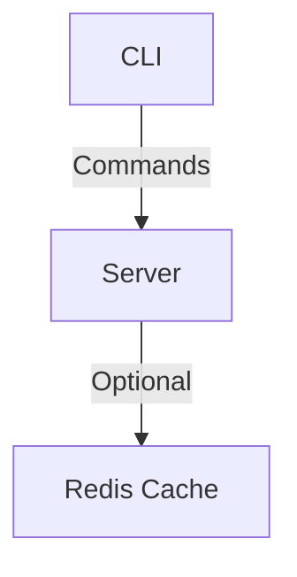

# s3fs

s3fs: A simple S3-like service to upload, get, list, and delete files efficiently. Before getting started, read `TOOLING.md` to learn about the tooling used for the project.

## Tooling and Release Information

For detailed information on the development environment setup, refer to `TOOLING.md`. This document outlines the tools used in the project, including installation instructions for each tool.

Additionally, `RELEASE.md` provides a comprehensive guide on the release process for the software, including how to create tags, build Docker images, and release the CLI on GitHub.


## Architecture



## Project Structure
```
s3fs/
├── cmd/
│   ├── serve.go            # Serve command for running the server
│   ├── store.go            # Store command to interact with the server; it has multiple subcommands like upload, get, delete, and list
│   └── root.go             # Entry point for CLI
├── pkg/
│   ├── filesystem/         # Filesystem package to perform basic operations on the filesystem
│   ├── gen/                # GRPC generated code
│   ├── cache/              # Cache package, used to store data in memory and Redis (not implemented yet)   
├── idl/
│   └── proto/              # Protocol buffer definitions
├── charts/
│   └── s3fs/               # Helm charts for deployment
├── server/
│   └── route/              # All server routes
```

## API Documentation
- [Proto Docs](https://buf.build/evalsocket/s3fs)

## Get Started

1. Run `make bootstrap` to set up the development environment.
2. Then run `make build-cli` to build the CLI, which will be located in `./bin/s3fs`. Users can use it.

Once the CLI is in place, start the server by running:
```shell
./bin/s3fs serve -d datastore
```

Note: For upload and download, we are using streaming. Calling these APIs from curl might not be possible, but connecting via RPC provides enough tooling to interact with the server from a browser. Users can also communicate with the server using GRPC. Currently, I am not generating the GRPC stub for Go, but it is possible with a small change.

## CLI Commands

Once the server is up and running, you can use the CLI to interact with the server. The following commands are available for managing the store:

- `s3fs store get [key]`: Retrieve an item from the store.
- `s3fs store upload [key] [file]`: Upload an item to the store.
- `s3fs store list`: List all items in the store.
- `s3fs store delete [key]`: Delete an item from the store.

Use `s3fs store --help` for more information on each command.

### Example

- Upload a file 

Help 
```shell
s3fs store get --help
```

Example
```shell
./bin/s3fs store upload -k go.sum -f ./go.sum 
Uploads an item to the store with the specified key and file. The file's content is sent to the storage service in smaller chunks.

Usage:
  s3fs store upload [key] [file] [flags]

Flags:
  -f, --file string   file to upload (default "./")
  -h, --help          help for upload
  -k, --key string    file name to upload a kind of id

Global Flags:
      --address string     Set the address of the storage service (default "http://127.0.0.1:8080")
      --log-level string   Set the logging level (default "error")
```

- List available files 
Help 
```shell
s3fs store get --help
Lists all items currently stored in the storage system. The result is returned in JSON format.

Usage:
  s3fs store list [flags]

Flags:
  -h, --help   help for list

Global Flags:
      --address string     Set the address of the storage service (default "http://127.0.0.1:8080")
      --log-level string   Set the logging level (default "error")
```

Example 
```shell
# Using Curl
curl --header 'Content-Type: application/json' --data '{}' http://127.0.0.1:8080/cloud.v1.StorageService/List

# Or using CLI 
./bin/s3fs store list
```

- Get a file 

Help 
```shell
s3fs store get --help
Retrieves an item from the store using the specified key and writes the result to the specified output file.

Usage:
  s3fs store get [key] [output_file] [flags]

Flags:
  -h, --help         help for get
  -k, --key string   file name to upload a kind of id

Global Flags:
      --address string     Set the address of the storage service (default "http://127.0.0.1:8080")
      --log-level string   Set the logging level (default "error")
```

Example 
```shell
./bin/s3fs store get -k go.sum
```

- Delete a file 

Help 
```shell
s3fs store delete --help
Removes an item from the store using the specified key.

Usage:
  s3fs store delete [key] [flags]

Flags:
  -h, --help         help for delete
  -k, --key string   file name to upload a kind of id

Global Flags:
      --address string     Set the address of the storage service (default "http://127.0.0.1:8080")
      --log-level string   Set the logging level (default "error")
```

Example using curl and cli
```shell
# Using Curl
curl --header 'Content-Type: application/json' --data '{ "object_key": "go.sum" }' http://127.0.0.1:8080/cloud.v1.StorageService/Delete

# Or using CLI 
./bin/s3fs store delete -k go.sum
```