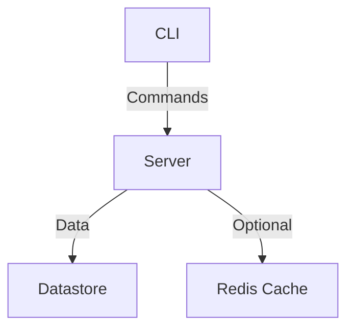

# s3fs

s3fs: A simple S3-like service to upload, get, list, and delete files efficiently. Before getting started, read `TOOLING.md` to learn about the tooling used for the project.

## Architecture



## Project Structure
```
s3fs/
├── cmd/
│   ├── serve.go            # CLI for task management
│   └── store.go         # Server entry point
│   └── root.go         # Server entry point
├── pkg/
│   ├── filesystem/         # Configuration management
│   ├── gen/            # GRPC generated code
│   ├── cache/        # Plugin model     
├── idl/
│   └── proto/          # Protocol buffer definitions
├── charts/
│   └── task/         # Helm charts for deployment
├── server/
│   └── route/         # All Server Routes
```

## API Documentation
- [Proto Docs](https://buf.build/evalsocket/s3fs)
- [Postmen Docs]()


## Get Started

1. Run `make bootstrap` to set up the development environment.
2. Then run `make build-cli` to build the CLI, which will be located in `./bin/s3fs`. Users can use it.

Once the CLI is in place, start the server by running:
```shell
./bin/s3fs serve -d datastore
```


## CLI Commands

Once the server is up and running, you can use the CLI to interact with the server. The following commands are available for managing the store:

- `s3fs store get [key]`: Retrieve an item from the store.
- `s3fs store upload [key] [file]`: Upload an item to the store.
- `s3fs store list`: List all items in the store.
- `s3fs store delete [key]`: Delete an item from the store.

Use `s3fs store --help` for more information on each command.


