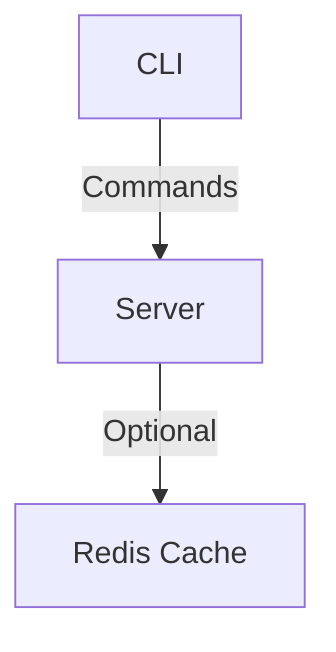

# s3fs

s3fs: A simple S3-like service to upload, get, list, and delete files efficiently. Before getting started, read `TOOLING.md` to learn about the tooling used for the project.

## Tooling and Release Information

For detailed information on the development environment setup, refer to `TOOLING.md`. This document outlines the tools used in the project, including installation instructions for each tool.

Additionally, `RELEASE.md` provides a comprehensive guide on the release process for the software, including how to create tags, build Docker images, and release the CLI on GitHub.


## Architecture



## Project Structure
```
s3fs/
├── cmd/
│   ├── serve.go            # Serve command for running the server
│   ├── store.go            # Store command to interact with the server; it has multiple subcommands like upload, get, delete, and list
│   └── root.go             # Entry point for CLI
├── pkg/
│   ├── filesystem/         # Filesystem package to perform basic operations on the filesystem
│   ├── gen/                # GRPC generated code
│   ├── cache/              # Cache package, used to store data in memory and Redis (not implemented yet)   
├── idl/
│   └── proto/              # Protocol buffer definitions
├── charts/
│   └── s3fs/               # Helm charts for deployment
├── server/
│   └── route/              # All server routes
```

## API Documentation
- [Proto Docs](https://buf.build/evalsocket/s3fs)

## Get Started

1. Run `make bootstrap` to set up the development environment.
2. Then run `make build-cli` to build the CLI, which will be located in `./bin/s3fs`. Users can use it.

Once the CLI is in place, start the server by running:
```shell
./bin/s3fs serve -d datastore

# Or use docker-compose.yaml
docker-compose up 
```

Note: For upload and download, we are using streaming. Calling these APIs from curl might not be possible, but connecting via RPC provides enough tooling to interact with the server from a browser. Users can also communicate with the server using GRPC. Currently, I am not generating the GRPC stub for Go, but it is possible with a small change.

## CLI Commands

Once the server is up and running, you can use the CLI to interact with the server. The following commands are available for managing the store:

- `s3fs store get -k [KEY]`: Retrieve an item from the store.
- `s3fs store upload -k [key] -f [file]`: Upload an item to the store.
- `s3fs store list`: List all items in the store.
- `s3fs store delete -k [key]`: Delete an item from the store.

Use `s3fs store --help` for more information on each command.


## Kubernetes Deployment
To deploy the service, we utilize a Helm chart. For testing purposes, a Kind cluster is created to simulate a production environment.

### Setting up the Kind Cluster
To create a Kind cluster for testing, execute the following command:
```shell
kind create cluster
```
After the cluster is created, verify the available namespaces using:
```shell
kubectl get ns
```

### Deploying the Service with Helm
Once the Kubernetes cluster is up and running, use the following Helm command to deploy the service:
```shell
helm upgrade s3fs ./charts/s3fs -n s3fs --create-namespace --install
```
This command will upgrade or install the `s3fs` service in the `s3fs` namespace, creating the namespace if it does not exist.

### Forwarding Ports for Service Access
To access the service from outside the cluster, you need to forward a port. Run the following command to forward port 8080 to the service's port 80:
```shell
kubectl port-forward service/s3fs 8080:80
```
This allows you to access the service at `http://localhost:8080`.

### Using the CLI with the Forwarded Service
To use the `s3fs` CLI with the forwarded service, specify the custom address using the `--address` flag. For example, to list items in the store, run:
```shell
./bin/s3fs store list --address http://localhost:8080 --log-level debug
```
This command will interact with the service at the forwarded address.


### Example Usage

#### Upload a File

To upload a file to the store, use the following command:
```shell
./bin/s3fs store upload -k go.sum -f ./go.sum
```
This command uploads the file `./go.sum` to the store with the key `go.sum`. The file's content is sent to the storage service in smaller chunks.

For more information on the `upload` command, run:
```shell
s3fs store upload --help
```
#### List Available Files

To list all items currently stored in the storage system, use the following command:
```shell
./bin/s3fs store list
```
This command returns the list of items in JSON format. You can also use `curl` to achieve the same result:
```shell
curl --header 'Content-Type: application/json' --data '{}' http://127.0.0.1:8080/cloud.v1.StorageService/List
```
For more information on the `list` command, run:
```shell
s3fs store list --help
```
#### Get a File

To retrieve an item from the store, use the following command:
```shell
./bin/s3fs store get -k go.sum
```
This command retrieves the item with the key `go.sum` from the store and writes the result to the specified output file.

For more information on the `get` command, run:
```shell
s3fs store get --help
```
#### Delete a File

To remove an item from the store, use the following command:
```shell
./bin/s3fs store delete -k go.sum
```
This command removes the item with the key `go.sum` from the store. You can also use `curl` to achieve the same result:
```shell
curl --header 'Content-Type: application/json' --data '{ "object_key": "go.sum" }' http://127.0.0.1:8080/cloud.v1.StorageService/Delete
```
For more information on the `delete` command, run:
```shell
s3fs store delete --help
```